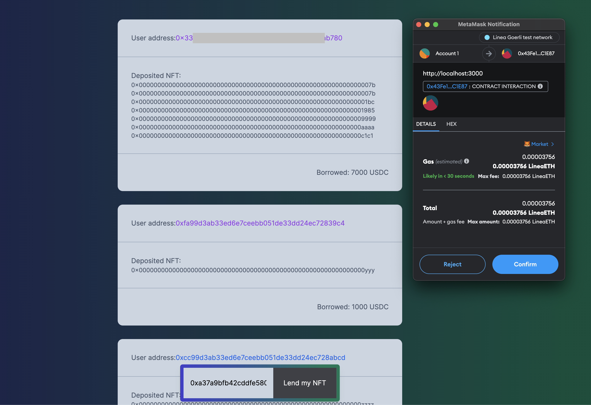

# Lending & Borrowing dApp

It consists of three parts. 

1. Smart contract (Solidity -> Linea Network)
1. Frontend (Next + Ts)
1. Backend (Express + Ts)

## Smart contract
Logic is simple. When `lendAndBorrow(uint256 _nftTokenId)` is executed, fake USDC will be transferred.

It's currently deployed on [Linea testnet](https://goerli.lineascan.build/).

### Deploy local
```
npm run deployLocal
```
### Deploy Linea testnet via Infura
Note: you need your own `PRIVATE_KEY` and `INFURA_API_KEY` in `.env`.
```
npm run deployLineaTest
```

## Frontend

It displays:
* Addresses of users who deposited NFTs
* Deposited NFT token IDs
* Borrowed USDC

Depoit NFT is possible via frontend if MetaMask is connected.

### Run in local
```
cd client/lending-borrowing-app/
npm run dev // if it's first time, run first 'npm run build'
```

## Backend
It uses Infura API in order to get logs data and interact with Frontend

### Run in local
```
cd server
npm run dev
```
